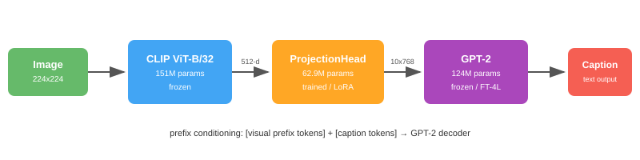
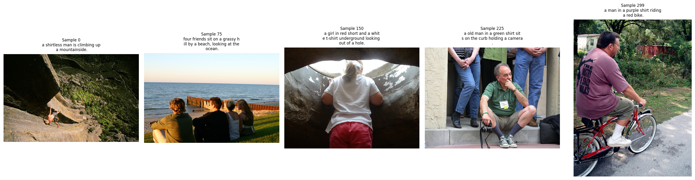
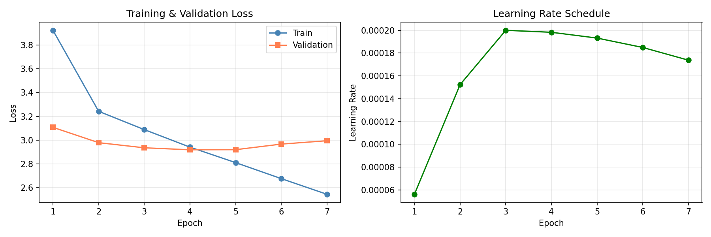
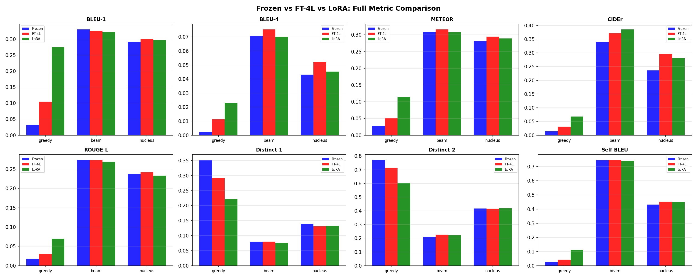
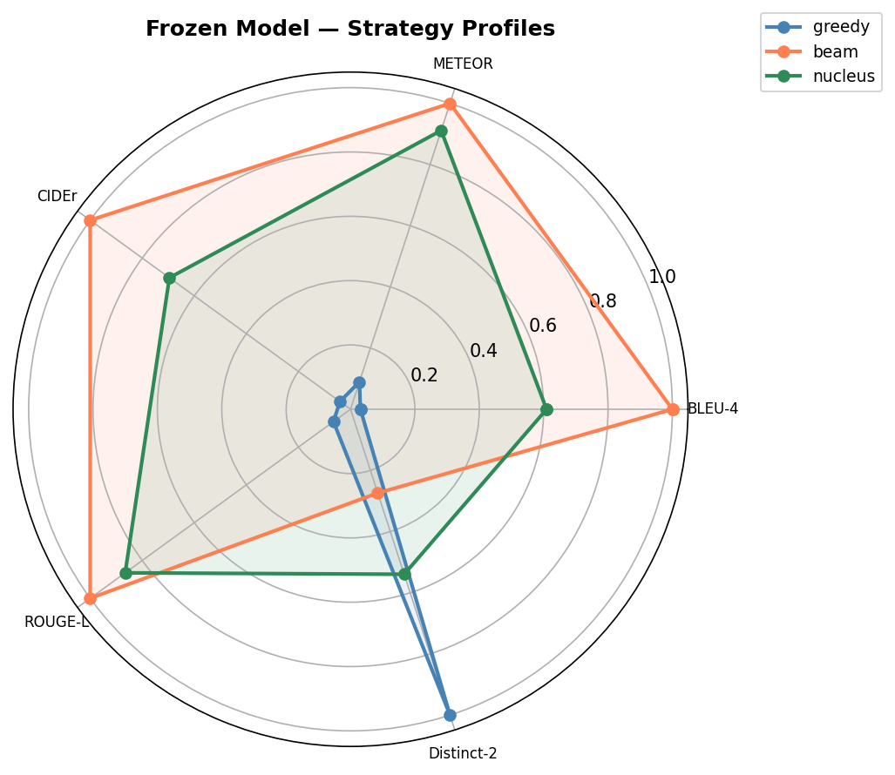
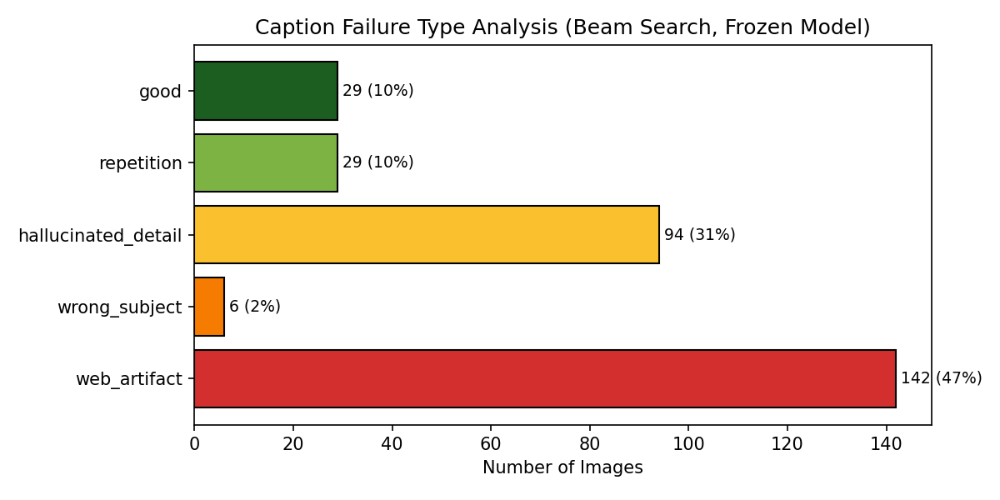

# IE7615 Generative Project — Image Captioning with CLIP + GPT-2

**Course:** IE7615 Neural Networks/Deep Learning SEC 02, Spring 2026

**Group 8:** Quoc Hung Le, Khoa Tran, Hassan Alfareed

## Overview

An image captioning system that combines OpenAI CLIP (ViT-B/32) as a visual encoder with GPT-2 as a language decoder. A learned ProjectionHead maps CLIP embeddings into GPT-2's input space via prefix conditioning, enabling visually-grounded caption generation.

## Architecture



The pipeline: Image (224x224) passes through frozen CLIP to produce a 512-d embedding. The ProjectionHead projects this into 10 prefix tokens (768-d each). These prefix tokens are prepended to GPT-2's input embeddings, conditioning the decoder on image content. GPT-2 then autoregressively generates the caption.

## Sample Results



*Five test images with ground-truth captions, CLIP embeddings, and GPT-2 tokenization (M1 pipeline validation).*

## Training



*Phase 1: ProjectionHead training with frozen GPT-2 (7 epochs, early-stopped at 4, val_loss=2.9193).*

## Evaluation — Three Model Comparison

Three fine-tuning strategies compared across 300 test images with 5 reference captions each:

| Model | Params | Val Loss | BLEU-4 | METEOR | CIDEr | ROUGE-L |
|---|---|---|---|---|---|---|
| Frozen | 62.9M | 2.9193 | 0.071 | 0.308 | 0.339 | 0.274 |
| FT-4L | 129.9M | 2.8899 | 0.075 | 0.316 | 0.371 | 0.274 |
| **LoRA (r=8)** | **63.8M** | **2.9172** | **0.070** | **0.308** | **0.386** | **0.269** |

*All metrics use beam search (w=5). LoRA achieves best CIDEr with only +0.8M extra parameters.*



## Strategy Profiles



*Beam search dominates accuracy (BLEU-4, METEOR, CIDEr, ROUGE-L). Nucleus sampling dominates diversity (Distinct-2). No single strategy wins all axes.*

## Failure Analysis



| Type | Count | Description |
|---|---|---|
| Web artifact | 106 (35%) | URLs, copyright, HTML from GPT-2 prior |
| Hallucinated detail | 105 (35%) | Wrong colors, objects, actions |
| Repetition | 48 (16%) | N-gram loops despite penalty |
| Good | 36 (12%) | BLEU-4 > 0.1, factually accurate |
| Wrong subject | 5 (2%) | Entirely different scene |

## Quick Start

```bash
# Clone
git clone https://github.com/lequo-neu/IE7615_Generative_Project.git
cd IE7615_Generative_Project

# Environment (macOS M1 / Apple Silicon)
conda env create -f environment.yml
conda activate ie7615-captioning
# or: pip install -r requirements.txt

# Run notebooks in order
jupyter notebook notebooks/milestone1_data_pipeline.ipynb
```

M1 will download Flickr30k (~4GB first run), extract CLIP embeddings, and save them for M2-M4. Subsequent milestones load precomputed embeddings without redownloading.

## Project Structure

```
Generative_Project/
├── README.md
├── environment.yml
├── requirements.txt
├── .gitignore
├── assets/                   README images
├── configs/
│   └── default.yaml
├── data/
│   ├── raw/                  (gitignored)
│   ├── processed/
│   └── embeddings/           (gitignored, regenerated by M1)
├── notebooks/
│   ├── milestone1_data_pipeline.ipynb
│   ├── milestone2_model_training.ipynb
│   ├── milestone3_evaluation.ipynb
│   └── milestone4_gallery.ipynb
├── src/
│   ├── data/                 dataset, preprocessing
│   ├── models/               clip_encoder, projection, caption_decoder
│   ├── training/             trainer, scheduler
│   ├── evaluation/           metrics, visualization
│   └── utils/                config, seed, logging
├── outputs/
│   ├── checkpoints/          (gitignored)
│   ├── figures/
│   ├── samples/
│   └── gallery/
├── reports/                  (gitignored, submit separately)
├── slides/
└── scripts/
```

## Milestones

| Milestone | Deliverables | Status |
|---|---|---|
| M1 — Data Pipeline | Flickr30k, CLIP embeddings, GPT-2 tokenization, 5 sample runs | Complete |
| M2 — Model Training | Prefix conditioning, frozen + FT training, 3 decoding strategies | Complete |
| M3 — Evaluation | BLEU/METEOR/CIDEr/ROUGE-L, temp/beam sweeps, LoRA, radar chart | Complete |
| M4 — Final | Caption gallery, demo pipeline, ethical reflection, final report | Complete |

## Key Findings

- **LoRA is the most efficient**: +0.8M params achieves CIDEr 0.386 (best), matching FT-4L's BLEU at 84x fewer extra parameters
- **Beam search for accuracy**: Best BLEU-4/METEOR/CIDEr/ROUGE-L across all models
- **Nucleus for diversity**: Highest Distinct-2, lowest Self-BLEU, richest vocabulary
- **Temperature 0.5 optimal**: Best CIDEr for nucleus sampling
- **Domain gap is the bottleneck**: 35% of captions contain GPT-2 web-text artifacts (URLs, copyright)
- **Early stopping is critical**: All models overfit within 2-4 epochs on 2,400 training images

## Tech Stack

- PyTorch 2.10 (MPS backend for Apple M1)
- HuggingFace Transformers 5.2
- PEFT (LoRA)
- CLIP ViT-B/32
- GPT-2 (124M)
- NLTK (BLEU, METEOR)

## Reproducibility

All experiments use seed=42 across Python, NumPy, PyTorch. Device auto-detects MPS > CUDA > CPU.

## License

Academic use only. IE7615, Northeastern University, Spring 2026.
