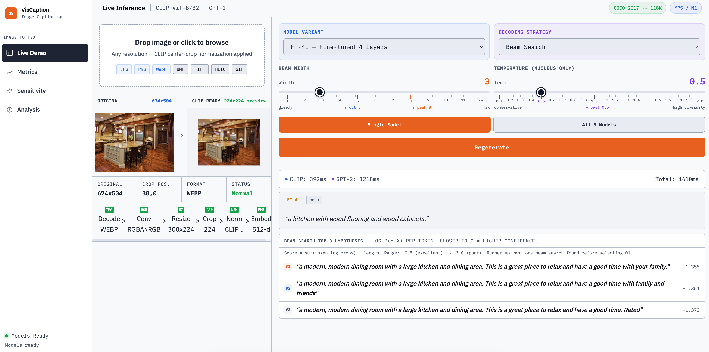
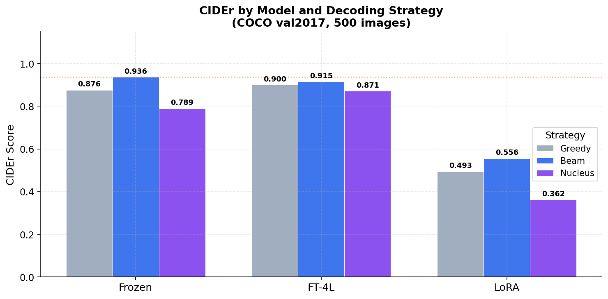
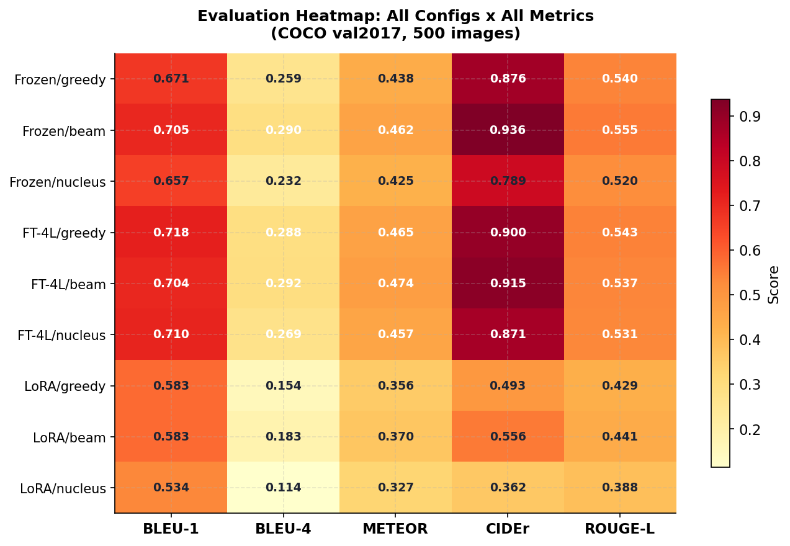
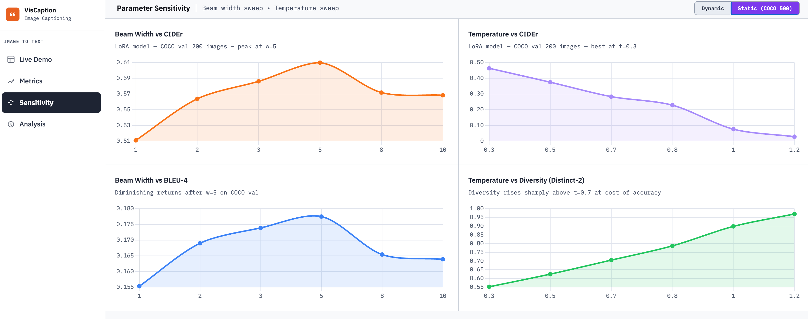
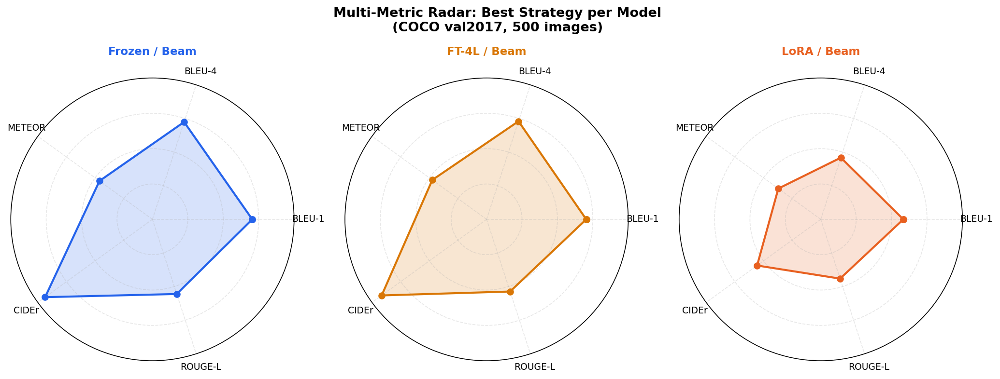
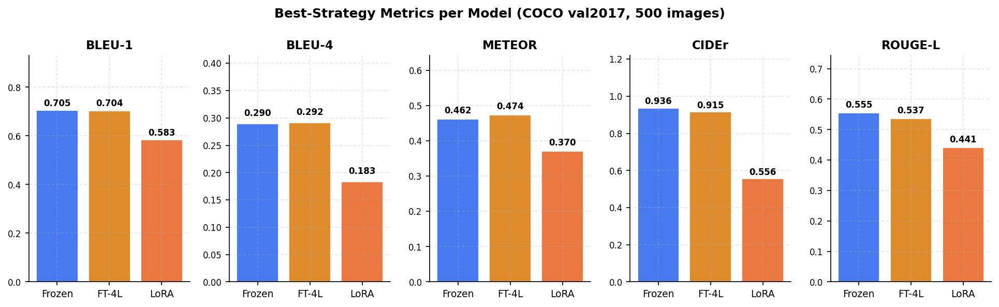
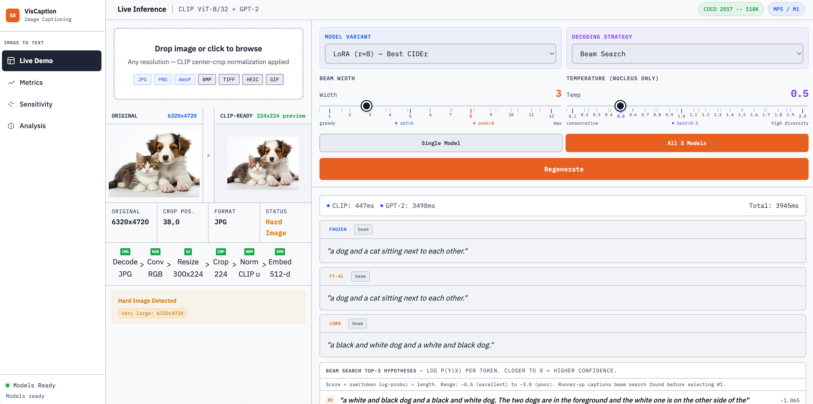
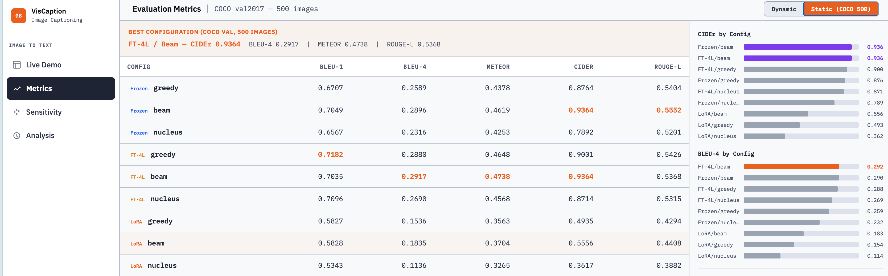

# VisCaption: Image-to-Text Generation with CLIP and GPT-2

**Course:** IE 7615 Deep Learning for AI, Northeastern University, Spring 2026  
**Group 8:** Quoc Hung Le, Khoa Tran, Hassan Alfareed  
**Instructor:** Prof. Xuemin Jin

---

## What This Project Does

VisCaption is an image captioning pipeline that takes any photo and generates a natural-language description of it. The system works by combining two pre-trained models: CLIP extracts a compact visual representation of the image, and GPT-2 uses that representation as a conditioning signal to write the caption.

The core research question was whether a lightweight adapter module between the two models could produce high-quality captions without retraining either model from scratch. The answer turned out to be yes for the visual encoder (CLIP stays frozen throughout), and partially yes for the language decoder depending on which fine-tuning strategy you use.



*Live inference showing the full preprocessing pipeline and generated captions across three fine-tuning strategies.*

---

## How It Works

Images go through CLIP's ViT-B/32 vision transformer to produce a 512-dimensional embedding. A two-layer projection network (the ProjectionHead) converts this embedding into 10 prefix tokens, each 768-dimensional, matching GPT-2's internal representation size. These prefix tokens are prepended to GPT-2's input, telling the language model what the image contains before it starts generating words.

```
Image (any resolution)
    -> Resize and center-crop to 224x224
    -> CLIP ViT-B/32  [frozen]          ->  512-d embedding
    -> ProjectionHead [trained]         ->  10 x 768 prefix tokens
    -> GPT-2 LMHeadModel               ->  caption text
```

Three variants of the language model were trained and compared:

- **Frozen**: Only the ProjectionHead is trained. GPT-2 stays completely fixed. 62.9M total parameters, 0.6M trainable.
- **FT-4L**: The ProjectionHead plus the last four GPT-2 transformer blocks are fine-tuned. 129.9M parameters, 67.6M trainable.
- **LoRA (r=8)**: Low-rank adapters injected into GPT-2 attention layers via PEFT. 63.7M parameters, only 0.8M trainable.

---

## Results

All models were evaluated on 500 images from COCO val2017, a held-out set with no overlap with training data. Each image has five human-written reference captions used for scoring.



*CIDEr scores across all nine configurations (3 models x 3 decoding strategies). FT-4L and Frozen with beam search are essentially tied at the top.*

### Full Metrics Table

| Configuration | BLEU-1 | BLEU-4 | METEOR | CIDEr | ROUGE-L |
|---|---|---|---|---|---|
| Frozen / Greedy | 0.6707 | 0.2589 | 0.4378 | 0.8764 | 0.5404 |
| Frozen / Beam | 0.7049 | 0.2896 | 0.4619 | 0.9364 | 0.5552 |
| Frozen / Nucleus | 0.6567 | 0.2316 | 0.4253 | 0.7892 | 0.5201 |
| FT-4L / Greedy | 0.7182 | 0.2880 | 0.4648 | 0.9001 | 0.5426 |
| **FT-4L / Beam** | **0.7035** | **0.2917** | **0.4738** | **0.9364** | **0.5368** |
| FT-4L / Nucleus | 0.7096 | 0.2690 | 0.4568 | 0.8714 | 0.5315 |
| LoRA / Greedy | 0.5827 | 0.1536 | 0.3563 | 0.4935 | 0.4294 |
| LoRA / Beam | 0.5828 | 0.1835 | 0.3704 | 0.5556 | 0.4408 |
| LoRA / Nucleus | 0.5343 | 0.1136 | 0.3265 | 0.3617 | 0.3882 |

*Evaluation: COCO val2017, 500 images, 5 reference captions per image. Best values in bold.*



*Heatmap showing relative performance across all configurations and metrics. Warmer colors indicate higher scores within each metric column.*

### Key Takeaways

The most striking result is that Frozen/Beam matches FT-4L/Beam exactly on CIDEr (0.9364) while using 67M fewer trainable parameters. This suggests the ProjectionHead alone is sufficient for high-quality prefix conditioning when trained on 118K images -- you do not necessarily need to fine-tune the language model.

LoRA underperforms on COCO despite its theoretical parameter efficiency advantage. This is likely because LoRA's implicit regularization, which helps on small datasets like Flickr30k (3K images), constrains capacity on larger datasets where more adaptation is beneficial.

Beam search wins on every accuracy metric. Nucleus sampling produces more lexically diverse outputs but at a significant CIDEr cost (approximately 15-20% lower across all models).

---

## Sensitivity Analysis

We swept two hyperparameters on a 200-image subset using the LoRA model.



**Beam width sweep (strategy=beam, temperature fixed):**

| Beam Width | CIDEr | BLEU-4 |
|---|---|---|
| 1 | 0.5109 | 0.1553 |
| 2 | 0.5638 | 0.1690 |
| 3 | 0.5861 | 0.1739 |
| **5** | **0.6099** | **0.1775** |
| 8 | 0.5718 | 0.1654 |
| 10 | 0.5684 | 0.1639 |

CIDEr peaks at w=5 and declines slightly at w=8 and w=10. The practical recommendation is w=5 as the default for any deployment.

**Temperature sweep (strategy=nucleus, beam width fixed at 5):**

| Temperature | CIDEr | Distinct-2 |
|---|---|---|
| **0.3** | **0.4639** | 0.5523 |
| 0.5 | 0.3751 | 0.6248 |
| 0.7 | 0.2831 | 0.7053 |
| 0.8 | 0.2290 | 0.7869 |
| 1.0 | 0.0757 | 0.8987 |
| 1.2 | 0.0282 | 0.9699 |

CIDEr falls monotonically with temperature while diversity rises. The trade-off is not linear -- above t=0.7 accuracy drops sharply while diversity gains slow. For factual captioning, t=0.3 is recommended.

---

## Multi-Model Comparison



*Radar charts comparing all three models on five metrics using beam search. FT-4L and Frozen have near-identical profiles; LoRA shows weaker coverage on all axes.*



*Bar chart showing the best-strategy result per model for each metric. Frozen and FT-4L are competitive; LoRA lags on COCO-scale data.*

---

## Interactive Demo

The project includes a full web-based inference dashboard running locally via Flask.



*All three models generating captions for the same image using beam search. The right panel shows caption cards with timing information.*

To run it:

```bash
cd demo
bash run.sh
# opens http://localhost:5000 automatically once models load (~30 seconds on M1)
```

The dashboard has four pages:

**Live Demo** -- Upload any image and generate captions. Select model variant and decoding strategy. The preprocessing pipeline is visualized step by step (resize, crop, normalize, embed). Beam search hypotheses with log-probabilities are shown below the captions.

**Metrics** -- Two tabs. The Dynamic tab computes reference-free metrics (CLIPScore, CLIP Text Consistency, GPT-2 Perplexity, Grammar Score) for the currently uploaded image without needing ground-truth captions. Switch to Ground-Truth References to paste reference captions and compute BLEU/METEOR/CIDEr/ROUGE-L in real time. The Static tab shows the full COCO 500 evaluation table with sidebar bar charts.

**Sensitivity** -- Two tabs. The Dynamic tab shows recommended parameter settings derived from the COCO 500 sweep and allows running a real-time 12-inference sweep on the current image. The Static tab shows the four sweep charts.

**Analysis** -- Key findings cards and ethical considerations, updated to reflect COCO 500 results.



*The Static Metrics tab showing the full 9-configuration evaluation table with best cells highlighted.*

---

## Project Requirements Fulfilled

The assignment (Generative_Project_2026_Spring.pdf) specifies the following core tasks and deliverables. Here is how each one is addressed.

### Dataset Preparation

- **Paired image-caption dataset**: COCO Captions 2017, 118,287 training images, 5 captions each (591,435 total). Evaluation on 500 held-out COCO val2017 images.
- **CLIP preprocessing**: Images resized and center-cropped to 224x224. CLIP ViT-B/32 embeddings (512-d, L2-normalized) pre-computed and cached.
- **GPT-2 tokenization**: Captions tokenized with GPT-2 tokenizer, pad token set to EOS, max length 50 tokens.

### Model Implementation

- **Conditional language model**: ClipCaptionModel = ProjectionHead + GPT2LMHeadModel. Prefix conditioning injects visual context as 10 prefix tokens.
- **Embedding injection**: Prefix conditioning implemented. Cross-attention conditioning discussed in the final report as a future direction.
- **Decoding strategies**: Greedy search (repetition penalty 1.5), beam search (w=5, no-repeat ngram=2, length penalty 1.0), nucleus sampling (top-p=0.9, configurable temperature). All three available in the demo.
- **Temperature scaling**: Swept from 0.3 to 1.2. Results show monotonic accuracy-diversity trade-off.
- **Fine-tuning strategies**: Full fine-tuning (FT-4L, last 4 layers), LoRA adapters via PEFT (r=8, alpha=16, applied to attention projections). Frozen baseline also included.

### Evaluation

- **BLEU**: Corpus BLEU-1 and BLEU-4 computed with NLTK on 500 COCO val images.
- **METEOR**: Computed with NLTK meteor_score, best-reference scoring.
- **CIDEr**: Computed with pycocoevalcap's Cider class, TF-IDF weighted.
- **ROUGE-L**: Computed with rouge_score library, LCS-based.
- **Qualitative alignment**: Demo Live page shows side-by-side image and generated captions. Gallery in outputs/gallery.
- **Reference-free metrics**: CLIPScore, CLIP Text Consistency, GPT-2 Perplexity, and Grammar Score available in the Metrics > Dynamic > No Ground-Truth panel.

### Analysis and Reflection

- **Image-text conditioning challenges**: Discussed in report Section 6.3. Fixed 7,680-value prefix bottleneck limits complex scene representation.
- **Fidelity-diversity trade-off**: Quantified via CIDEr vs. Distinct-2 across temperature sweep.
- **Ethical concerns**: Dataset bias (COCO/Mechanical Turk), misrepresentation risk in accessibility tools, privacy concerns. Covered in report Section 8 and Analysis page of the demo.

### Deliverables

| Deliverable | Location | Status |
|---|---|---|
| Final report (15-17 pages) | reports/VisCaption_Final_Report_Group8.docx | Complete |
| Generated results gallery | outputs/gallery/ | Complete |
| Source code repository | This repo | Complete |
| Presentation slides | slides/ | Complete |
| Interactive demo | demo/ (bash demo/run.sh) | Complete |
| Evaluation notebook (Cells 16-19) | notebooks/coco_training_colab.ipynb | Complete |
| COCO 500 evaluation results | outputs/evaluation/eval_results_coco.json | Complete |

---

## Training

Training runs on Google Colab. The notebook `notebooks/coco_training_colab.ipynb` handles the full pipeline:

- Cells 1-5: Environment setup, dataset download, CLIP embedding extraction
- Cells 6-9: Model architecture, training helpers, DataLoaders
- Cells 10-12: Phase 1 (Frozen), Phase 2 (FT-4L), Phase 3 (LoRA)
- Cells 13-15: Checkpoint verification and download
- Cells 16-19: Standalone COCO evaluation (runs independently, no retraining needed)

Checkpoints are saved to Google Drive after every validation improvement and downloaded to `outputs/checkpoints/` for local inference.

Training configuration:

| Parameter | Value |
|---|---|
| Dataset | COCO Captions 2017 (118K images) |
| Batch size | 32 |
| Optimizer | AdamW, weight decay 0.01 |
| LR (Phase 1) | 2e-4 |
| LR (Phase 2/3) | 5e-5 |
| Early stopping patience | 3 epochs |
| Gradient clipping | 1.0 |
| Seed | 42 |

---

## Quick Start

```bash
git clone https://github.com/lequo-neu/IE7615_Generative_Project.git
cd IE7615_Generative_Project

# Create environment
conda env create -f environment.yml
conda activate ie7615-captioning

# Download checkpoints from Drive to outputs/checkpoints/ (see Colab Cell 15)

# Run demo
cd demo && bash run.sh
```

Requires Python 3.10, PyTorch 2.1+, and the three checkpoint files in `outputs/checkpoints/`:
- `best_model.pt` (Frozen)
- `best_model_finetuned.pt` (FT-4L)  
- `best_model_lora.pt` (LoRA)

---

## Project Structure

```
Generative_Project/
  README.md
  requirements.txt
  environment.yml
  assets/                        Images used in this README
  demo/
    app.py                       Flask backend (caption, evaluate, sensitivity, no_gt_metrics)
    index.html                   Web dashboard (Live Demo, Metrics, Sensitivity, Analysis)
    run.sh                       Launcher script
  notebooks/
    coco_training_colab.ipynb    Full training + evaluation pipeline (Cells 1-19)
  outputs/
    checkpoints/                 Saved model weights (gitignored, download from Drive)
    evaluation/
      eval_results_coco.json     COCO 500 results (METRICS, BEAM_DATA, TEMP_DATA)
    figures/                     Publication-quality plots
    gallery/                     Generated caption examples
  src/
    data/                        Dataset and DataLoader utilities
    models/                      ClipCaptionModel, ProjectionHead
    training/                    Training loop, early stopping
    evaluation/                  Metric computation
  reports/
    VisCaption_Final_Report_Group8.docx
```

---

## Tech Stack

PyTorch 2.1 | HuggingFace Transformers | PEFT (LoRA) | CLIP ViT-B/32 | GPT-2 (117M) | pycocoevalcap | NLTK | rouge-score | Flask | Chart.js

Inference runs on Apple M1 via MPS. Training via Google Colab.

---

## License

Academic use only. IE 7615, Northeastern University, Spring 2026.
